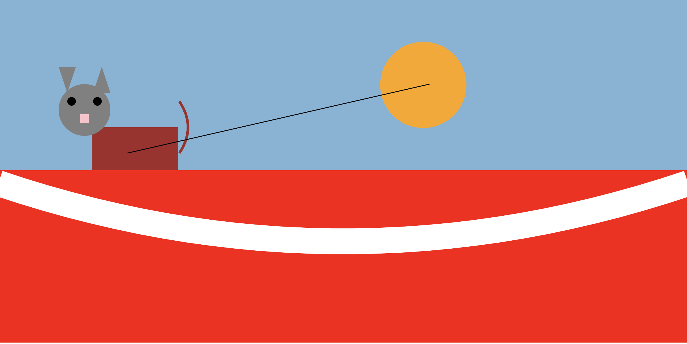
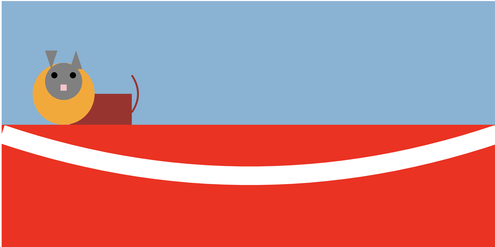

Assignment 1 - Hello World: GitHub and d3  
===
1. **Link to gh-pages site:** https://qjxberry.github.io/a1-ghd3/

2. **Motivation for creation:** I am fond cute cartoon comics, and based on my liking for Peppa Pig, I tried my best to draw a simple picture of her though it's not like that much.

3. **Elements used to render:**
   3.1  Square: one red rectangle and one white path in the sqaure

   3.2 picture on the square groud:  two gray triangles to render ears,  two black circles to render eyes, 
         one pink square to render mouth, 
         one big gray circle to render face, 
         one big rectangel to render her body and a tail.

    
    

4. **Technical Achievement Desription:**
    4.1 D3.js Integration: Start to learn proficiency in integrating the D3.js library to create dynamic and interactive visualizations. And highlight the use of SVG grouping (<g>) to organize and structure related elements.

    4.2 Event Handling: Showcase event handling capabilities, such as responding to user clicks and triggering animations.

    4.3 Animations: Highlight the use of smooth transitions and animations using D3.js, enhancing the visual appeal and user experience. Emphasize the ability to dynamically create and manipulate SVG elements through JavaScript. Explain how styles are dynamically changed based on data or interactions.
   
    4.4 Path Animation: Discuss the implementation of path animations, specifically in the context of the pig's tail movement. Describe the logic behind complex movements, like moving the circle to the pig's body with synchronized motions. The moveCircleTopig function showcases complex movement logic, smoothly transitioning the circle to the pig's body with synchronized movements.

    4.5 Other: Successfully implemented a feature that dynamically adjusts the distance between the pig's tail and body by moving the pig's body, achieving a visually pleasing tail attachment. And implemented dynamic calculations to ensure that the circular movement stops at a position that precisely overlaps with the pig's face, creating an aesthetically interesting composition

5. **Design Achievement Description:**
    5.1 Visual Hierarchy: Discuss how the visualization establishes a clear visual hierarchy with distinct elements representing different parts of the pig and its environment. Explain the choice of colors in the palette and how they contribute to a visually appealing representation of the pig and its surroundings.

    5.2 Interactive Elements: Discuss the incorporation of interactive elements, such as clickable parts of the pig and resulting animations, to enhance user engagement. Describe how shapes and colors are used to create a realistic representation of a pig, contributing to the overall visual appeal.

    5.3 Symbolism: Discuss any symbolic elements used in the visualization, adding depth and meaning to the overall design. Highlight the consistency in styling throughout the visualization, creating a cohesive and unified visual experience. Emphasize attention to detail in the design, such as the shape of the pig's ears, eyes, and tail.

    5.4 Other: Achieved visual harmony by allowing users to set a specific tail distance and ensuring a seamless connection between the pig's tail and body during movement. Demonstrated a commitment to aesthetic precision by ensuring that the stopping position aligns perfectly with the pig's face, resulting in a visually satisfying and well-composed image

